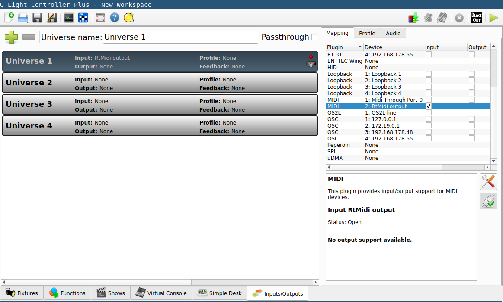

# Map mouse/keyboard to MIDI and/or Art-Net

Python scripts to map keyboard events and/or mouse buttons to MIDI messages in Linux, e.g., for use in QLC+.

## Prerequisites
- Linux
- `evtest`
- Python
- Python packages `mido`, `rtmidi` and `python-rtmidi` (e.g., via pip or AUR packages `python-mido` and `python-rtmidi`, requires `libasound2-dev` and `libjack-dev`)

To create a suitable virtual Python environment,
1. Run `python -m venv .venv`
1. Run `.venv/bin/pip install -r requirements.txt`

## Capturing mouse buttons and sending MIDI events
This method captures mouse events with `evdev` and sends MIDI events. Thanks to python-evdev's `grab` method, the mouse will be disabled while the script is running in order not to disturb other programs.
1. Run `sudo evtest` and select your desired device
1. Remember the input device name
1. Adapt the file `DEVICE_NAME` according to your setup and run `.venv/bin/python evdevmidi.py` or `python evdevmidi.py`

### Config mode
1. Press `left` + `middle` + `right` mouse button at the same time to enter config mode
1. You can now select the maximum scrolling value by scrolling
1. Confirm, save and leave config mode by pressing `left` + `middle` + `right` mouse button instantaneously again

## Using Art-Net messages in MadMapper/QLC+
The script will broadcast Art-Net messages on the following DMX-channels in the selected Art-Net Universe:
|Channel|Input                          |Value                          |
|---    |---                            |---                            |
|1      |Left button                    |0 (off), 255 (pressed)         |
|2      |Right button                   |0 (off), 255 (pressed)         |
|3      |Middle button                  |0 (off), 255 (pressed)         |
|4      |Scrollwheel                    |0-255                          |
|5      |Scrollwheel in config mode     |maximum scrolling value (0-255)|

## Using MIDI messages in QLC+
1. (Re-) Start QLC+ after running `evdevmidi.py`
1. Activate "RtMidi output" as Input in the Inputs/Outputs tab

1. Select Profile "None"
1. Register External Input in the properties of a button in your Virtual Console
1. Enjoy strobe, fog and more with your mouse on the dancefloor!

## Autostart
### With cron
1. Run `sudo crontab -e`
1. Add `@reboot sleep 5 && sh /home/pi/midi-mouse/midimouse.sh`
1. Append `>/home/pi/logs/cronlog 2>&1` for logging if needed (caution, may cause big log file!)

### With autostart file
Create `~/.config/autostart/evdevmidi.desktop` with the following content with the path adjusted to your setup to start the script upon bootup:
```
[Desktop Entry]
Type=Application
Name=evdevmidi
Exec=python <path-to-midi-mouse>/evdevmidi.py
StartupNotify=false
```

## Legacy: Remapping mouse buttons to keyboard keys and sending MIDI events
This method is particularily usefull if you would like to use a mouse on a system that is used for other purposes such as djing at the same time such that the mouse should not move and click on things randomly.

### Remapping of mouse buttons to keyboard keys
Remap your mouse buttons to keyboard key events according to [this](https://askubuntu.com/a/1145638/795463) post:
1. Run `sudo evtest` and select your desired device
1. Remember the first few rows, in which the output should look like
    ```
    Input device ID: bus 0x3 vendor 0x46d product 0x4054 version 0x111
    Input device name: "Logitech Wireless Mouse"
    ```
1. Hit the buttons you want to remap. The output should look like
    ```
    Event: time 1692904552.423840, type 4 (EV_MSC), code 4 (MSC_SCAN), value 90001
    Event: time 1692904552.423840, type 1 (EV_KEY), code 272 (BTN_LEFT), value 0
    Event: time 1692904552.423840, -------------- SYN_REPORT ------------
    Event: time 1692904553.063921, type 4 (EV_MSC), code 4 (MSC_SCAN), value 90002
    Event: time 1692904553.063921, type 1 (EV_KEY), code 273 (BTN_RIGHT), value 1
    ```
1. Create a new file `/etc/udev/hwdb.d/99-mouse-remap.hwdb` with

    ```
    evdev:input:b[bustype]v[vendor]p[product]e[version]*
     ID_INPUT_KEY=1
     KEYBOARD_KEY_[msc-scancode]=[desired-key]
     KEYBOARD_KEY_[msc-scancode]=[desired-key]
     KEYBOARD_KEY_[msc-scancode]=[desired-key]
    ```
    1. Replace `[bustype]`, `[vendor]`, `[product]` and `[version]` with the values from the output of the second command with letters converted to uppercase
    1. Replace `[msc-scancode]` with the scancodes in the output of the third step converted to lowercase
    1. Make sure `evdev:` has no preceding space and `ID_INPUT_KEY` and `KEYBOARD_KEY` have excactly one preceding space
1. The resulting file could look like
    ```
    evdev:input:b0003v046Dp4054e0111*
     ID_INPUT_KEY=1
     KEYBOARD_KEY_90001=1
     KEYBOARD_KEY_90002=2
     KEYBOARD_KEY_90003=3
    ```
1. Now run `sudo systemd-hwdb update` and reboot (or run `sudo udevadm control --reload-rules && sudo udevadm trigger`)

### Capturing keyboard events and sending MIDI messages
Adapt `MOUSE_NAME` and `MAPPING` variables according to your setup and run `midiremap.py`

## Credits/Ressources
- https://askubuntu.com/a/1145638/795463
- https://unix.stackexchange.com/a/171583/310042
- https://wiki.archlinux.org/title/Map_scancodes_to_keycodes